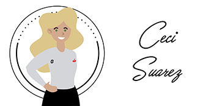
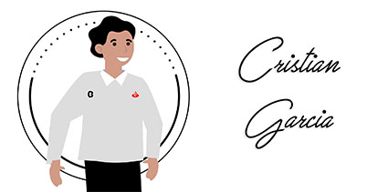

# 🏨  API Xacalli Posada

Creación de una API para el Hotel PetFriendly denominado [“Xacalli Posada”](https://www.facebook.com/XacalliEnTepoztlan), ubicado en Tepoztlán Morelos.

### 💡 Nota:

> Este proyecto se realizó cómo parte de la finalización del módulo de BackEnd de [Bedu](https://bedu.org/), el [equipo 1](#autores) creó la API implementando todo lo aprendido durante el módulo.

# 🚀 Requerimientos del proyecto

El hotel requiere agilizar su proceso de toma de decisiones dentro su área de ventas, necesita un espacio en el cual pueda visualizar y analizar los diferentes datos que sus huéspedes le proporcionan.

Algunos de los procesos son:
* **Seguimiento dentro del proceso de venta:** 
    * Asignar un vendedor
    * Verificar disponibiidad:
        * Determinadas fechas
        * Las diferentes habitaciones
        * Servicios
* **Obtener sólo determinados campos de sus huéspedes:**
    * Estadisticas
        * Nacionalidad (¿De dónde los visitan?)
        * No. noches que se hospedan
        * Valoración (Calificación que los húespedes le asignan a su estadía)
    * Remarketing:
        * El e-mail de los húespedes para enviar promociones

# 🎯 Objetivo

Agilizar los procesos dentro del área de ventas del hotel, mediante la estructuración y configuración de un CRM (Customer Relationship Management) personalizado.

La correcta implementación del proyecto por parte del hotel se traducirá cómo la optimización en la toma de decisiones dentro de su departamento de ventas; el CRM agilizará no sólo la visualización si no también la gestión de sus diferentes datos.

# 📖 Desarrollo del Proyecto

## 👱 Usuarios

## 📝 Creación de la Base de Datos

|Nombre Tabla | Campos | Descripción |
| ------------- | ------------- |
| Empleado | * id_epo * nombre * apellido * salario * telefono * comision *edo_id_edo | Datos del empleado |
| Cliente | * id_cte * nombre * apellido * teléfono * no_personas * no_mascotas * nacionalidad * email * facebook * epo_id_epo |

# ✒️ Autores 

   
 

# 🎁  Agradecimiento Especial

Todos los integrantes del equipo 1, agradecemos infinitamente la oportunidad que nos brindaron **Santander** y **Bedu** de participar dentro del programa __“Becas Santander – BEDU: Disruptive Innovation: 3 caminos para impulsar tu carrera"__, en el Learning Path **Desarrollo Web**.

Somos muy afortunados de formar parte de este gran proyecto. 
Esperamos nos honren con la oportunidad de continuar retando nuestro potencial en la siguiente fase del programa.  
