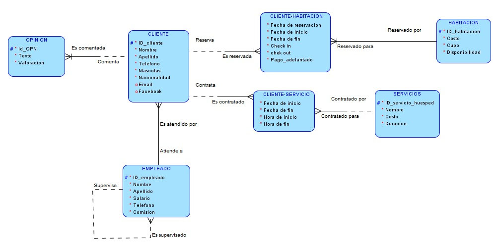
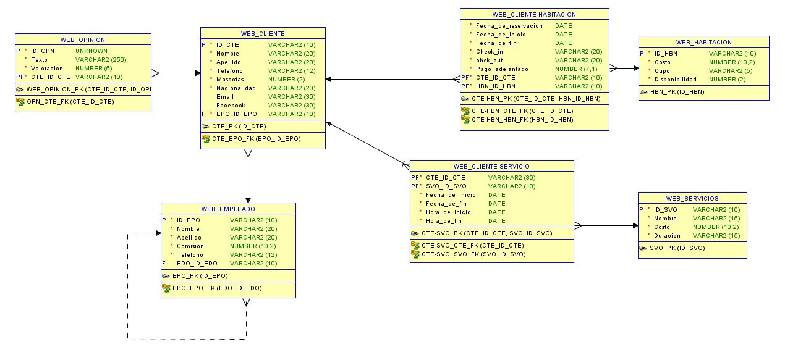

# 🏨  API Xacalli Posada

Creación de una API para el Hotel PetFriendly denominado [“Xacalli Posada”](https://www.facebook.com/XacalliEnTepoztlan), ubicado en Tepoztlán Morelos.

### 💡 Nota:

> Este proyecto se realizó cómo parte de la finalización del módulo de BackEnd de [Bedu](https://bedu.org/), el [equipo 1](#autores) creó la API implementando todo lo aprendido durante el módulo.

# 🚀 Requerimientos del proyecto

El hotel requiere agilizar sus procesos de toma de decisiones dentro su área de ventas, necesita un espacio en el cual pueda visualizar los diferentes datos que sus huéspedes le proporcionan.

Actualmente el hotel realiza sus reservaciones apoyandose de un método anticuado y disfuncional. Consigue sus prospectos por medio de Facebbok, realiza su labor de venta y en caso de que se deseen hospedar apunta la reservación en una hoja de papel; en ocasiones no recuerda dónde apunto los datos, por lo que constantemente se realizan las siguientes preguntas:
 * ¿Ya tengo reservaciones confirmadas?.
 * ¿Cuánto dejó de anticipo el húesped?.
 * ¿Para cuántas personas es la reservación?.
 * ¿De cuántas noches es su reservación?.
 * ¿En qué fecha se hospedarán?.
 * ¿Todavía cuento con disponibilidad en esa fecha?.
 * ¿Puedo seguir ofertando las demás cabañas/habitaciones?.

## Optimización de procesos

Algunos de los procesos que les gustaría optimizar son:
* **Seguimiento dentro del proceso de venta:** 
    * Asignar un vendedor.
    * Verificar disponibiidad:
        * Determinadas fechas.
        * Las diferentes habitaciones.
        * Servicios.
* **Obtener sólo determinados campos**
    * De sus huéspedes:
        * Estadisticas:
            * Nacionalidad (¿De dónde los visitan?).
            * No. noches que se hospedan.
            * Valoración (Calificación que los húespedes le asignan a su estadía).
        * Remarketing:
            * El e-mail y el télefono de los húespedes para enviar promociones.
    * De sus empleados:
        * Saber cúal fue la comisión que obtuvieron por reservación o por mes. 

# 🎯 Objetivo

Innovar y optimizar los procesos dentro del área de ventas del hotel, mediante la estructuración, sistematización y configuración de un CRM (Customer Relationship Management) personalizado.

La correcta implementación del proyecto por parte del hotel se traducirá cómo la optimización en la toma de decisiones dentro de su departamento de ventas (reduciendo el tiempo de respuesta por parte del vendedor al huésped); el CRM agilizará no sólo la visualización si no también la gestión de sus diferentes datos.

# 📖 Antecedentes del Proyecto
Depués de tener una breve entrevista con el dueño del hotel obtuvimos la siguiente información:

## Hotel Petfriendly
* Es un hotel PetFriendly, por lo que los húespedes pueden llevar a sus mascotas.

## Cabañas/Habitaciones

* **Cabañas/Habitaciones:**
    * Cuenta con 6 cabañas/habitaciones:
        * 5 Tienen cama matrimonial, son para 2 personas y tiene un precio por noche de $1,300 cada una.
        * 1 Tiene cama matrimonial e individual, es para 3 personas y tiene un precio por noche de $1,600.
    * La capacidad total del hotel es de 13 personas.
    * Todas las cabañas/habitaciones tienen:
        * Baño.
        * Pequeño clóset.
        * Escritorio y silla.
        * Televisión y DVD.

## Instalaciones

* **Sus instalaciones incluyen:**
    * Alberca.
    * Amplio jardín. 
    * Comedor / Estancia al aire libre.
    * Estacionamiento.
    * Jacuzzi. 

## Servicios
* **Los servicios que ofrecen:**
    * ***Sin costo adicional***:
        * Asador con duración de 4 hrs.
        * Camping con duración de 24 hrs.
        * Telescopio con duración de 2 hrs.
        * Wifi.
    * ***Con costo adicional***:
        * Fogata  $400 con duración de 2 hrs.
        * Hiking  $50 con duración de 2 hrs.
        * Masaje  $600 con duración de 55 min.
* Todos los servicios, excluyendo el *Wifi*, se deben notificar con anticipación para verificar disponibilidad.

## Empleados
* Tienen un salario base de $500.

* Se le paga al empleado una comisión de $250 por cada cabaña/habitación que rente por noche.
    * Por ejemplo:
        * Si una pareja (2 personas) se hospeda de viernes a domingo, son dos noches. Siendo $500 de comisión.
        * Si 2 parejas (4 personas) se hospedan de domingo a lunes, es decir, una noche. De igual forma serían $500 de comisión; aunque es una sola noche son dos las cabañas/habitaciones que se rentaron.

## Reservación
* **Proceso de reservación:**
    1. El Huésped proporciona sus datos:
        * Nombre Completo.
        * Teléfono.
        * Fechas de la reservación:
            * Inicio.
            * Fin.
        * No. de noches que se hospedará.
        * No. de personas a hospedarse.
        * No. mascotas que viajarán con ellos.
        * Nacionalidad.
    2. Se verifica que exista disponibilidad:
        * Fecha de inicio y fin de reservación.
        * Cabañas/Habitaciones, además de que puedan recibir el número de personas que indicó el huésped. 
    3. En caso de existir disponibilidad, se le pide al huésped que realice el deposito de su anticipo (equivalente al 50% de su estadía) con el fin de confirmar su reservación. El restante lo Liquidará cuándo se encuentre en las instalaciones del hotel.

    4. Cuando el huésped envié el comprobante del pago de su anticipo, se confirma la reservación y se le pregunta si desearía adquirir algún servicio adicional para su estadía. En caso de que requiera de algún servicio se le indicará el costo, duración y se le notificará que el costo de este se cubrirá cuándo se encuentre en las instalaciones del hotel.

    5. Se realiza una segunda confirmación cuándo el huésped realiza su check-in, ya que han existido casos en los que realizan el deposito del anticipo pero no se presentan a las instalaciones, por lo que se podría ofrecer esa habitación si llegará algún huésped de improviso.

# 🔧 Desarrollo del Proyecto

## 👱 Usuarios

#### Tipos de Usuarios 

Para el correcto funcionamiento de la API, únicamente se requieren 2 usuarios. 

Mismos que se detallan a continuación:

##### Cliente (Huésped)

Individuo que pide informes del hospedaje, deseando reservar una determinada fecha para hospedarse en el hotel.

Suele proporcionar los siguientes datos para preguntar sobre la disponibilidad :
* Nombre Completo.
* Teléfono.
* Fechas de la reservación:
    * Inicio.
    * Fin.
* No. de personas a hospedarse.
* No. mascotas que viajan con ellos.
* Nacionalidad.

###### Historias de usuario
Únicamente puede agregar sus datos para pedir informes.

##### Vendedor
Responsable del seguimiento de renta de las cabañas.

Entre sus principales funciones destacan: 
* Brindar informes del hospedaje.
* Verificar disponibilidad de las habitaciones.
* Darle seguimiento en general a todas las dudas del cliente/huésped con la finalidad de que
confirme su reservación.

###### Historias de usuario
Este usuario puede realizar las siguientes acciones:
* Agregar Clientes.
* Modificar Clientes.
* Eliminar Clientes.
* Consultar atributos específicos de los Clientes.

## 📝 Creación de la Base de Datos

### Entidades

* Empleado.
* Cliente.
* Habitación.
* Opinión.
* Cliente_habitación.
* Cliente_servicio.

### Modelo ER

### Modelo relacional

# 🔩 Integración del Proyecto

# ✒️ Autores 

   
 

# 🎁  Agradecimiento Especial

Todos los integrantes del equipo 1, agradecemos infinitamente la oportunidad que nos brindaron **Santander** y **Bedu** de participar dentro del programa __“Becas Santander – BEDU: Disruptive Innovation: 3 caminos para impulsar tu carrera"__, en el Learning Path **Desarrollo Web**.

Somos muy afortunados de formar parte de este gran proyecto. 
Esperamos nos honren con la oportunidad de continuar retando nuestro potencial en la siguiente fase del programa.  
     